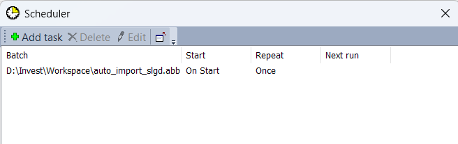

1. Introduction
- The purpose of this tool is to automatically parse EOD data for Vietnamese stock market from cafef web page,
then import the latest data into Amibroker software.
The target data is 'data 3 san: HOSE, HNX, UPCOM'
2. Prerequisites
- Python 3 is required.
- Prior to running, please install required Python libs by running 'python -m pip install -r ../requirements.txt'
3. How the tool works
- A Python script using requests and BeautifulSoup libs to get the .csv data files from cafef webpage.
- An Amibroker batch file (.abb) is used to automatically import the downloaded csv files into Amibroker.
4. User manual
- Update file ./user_config.ini
- Open Amibroker, register a new automatic batch schedule under Menu/Tools/Scheduler and point to the ./auto_import_slgd.abb, save the schedule.

- Close Amibroker.
- Adapt the ./amibroker.bat file to use the SW paths on your PC
- Click amibroker.bat file to run the batch.
- Enjoy the latest EOD data!
Note: The program generates logs in ./log.txt file, meanwhile Amibroker generates logs in ./broker.log file.